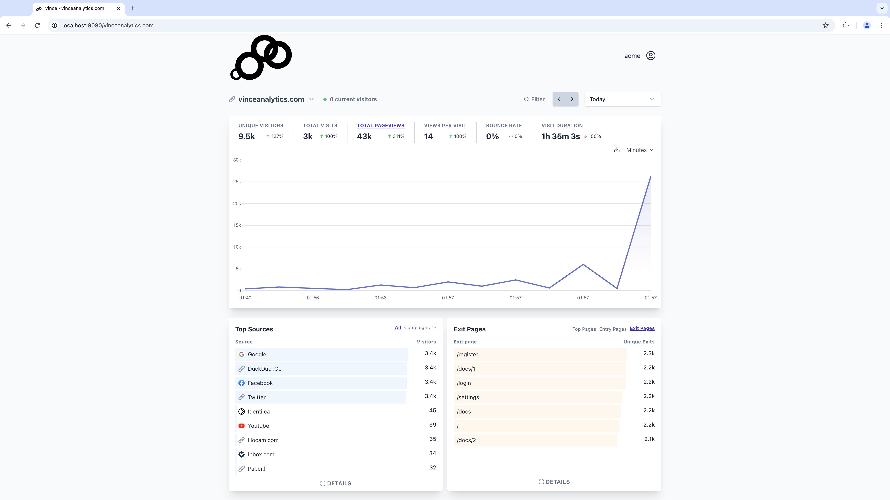

## vince

**Vince** is a privacy friendly web analytics server focused on painless self hosting.




# Features

- [**Automatic TLS**](https://www.vinceanalytics.com/guides/config/auto-tls/) native support for let's encrypt.
- **Drop in replacement for plausible** you can use existing plausible  scripts and just point them to the vince instance (note that vince is lean and only covers features for a single entity self hosting, so it is not our goal to be feature parity with plausible).
- **Outbounds links tracking**
- **File download tracking**
- **404 page tracking**
- **Custom event tracking**
- **Time period comparison**
- **Public dashboards** allow access to the dashoard to anyone(by default all dashboards are private).
- **Unique shared access** generate unique links to dahboards that can be password protected.
- **Zero Dependency**: Ships a single binary with everything in it. No runtime dependency.
- **Easy to operate**: One line commandline flags with env variables is all you need.
- **Unlimited sites**: There is no limit on how many sites you can manage.
- **Unlimited events**: scale according to availbale resources.
- **Privacy friendly**: No cookies and fully compliant with GDPR, CCPA and PECR.


# Installation

Vince ships a single executable without any dependencies.


## Installing

### MacOS and Linux

```
curl -fsSL https://vinceanalytics.com/install.sh | bash
```

### Docker

```
docker pull ghcr.io/vinceanalytics/vince
```

### Download 

[see release page](https://github.com/vinceanalytics/vince/releases)


## Checking installation

```
vince --version
```

## Start vince

***create admin***
```
❯ vince admin --name acme --password 1234
```

***start server***
```
❯ vince serve                            
2024/10/23 15:32:08 [JOB 1] WAL file vince-data/pebble/000002.log with log number 000002 stopped reading at offset: 124; replayed 1 keys in 1 batches
2024/10/23 15:32:08 INFO starting event processing loop
2024/10/23 15:32:08 INFO starting server addr=:8080
```

# FAQ

## Does the binary size affect performance ?

| compressed | uncompressed|
|------------|-------------|
| 122MB      | 310 MB      |

To ensure smooth deployments we embed a couple of things

| asset   | size | notes|
|---------|------|------|
| mmdb    | 108MB | City Geolocation  Database from https://db-ip.com under  Creative Commons Attribution 4.0 International License.|
| geoid database| 384MB | All cities, countries and regions data|


The reason you can breakdown by city/region is because we derive city/region geoid from city/region names from our
embedded geoid data, something that would have been impossible because geoid is missing from the 
free mmdb downloads.

We use a number of techiques to shrink the embedded assets and avoud excessive memory
allocations.

- ***flatbuffers***: we organize location data using flatbuffers in such a way that we never
 decode and values from embedded memory are passed around to avoid any allocation. An 
 idle vince instance consumes around `14MB` and `0.0%` of cpu.
- ***Bit sliced seralized roaring bitmaps***: all mapping with embedded data is encoded as BSI.
Like flatbuffers, there is no decoding, we use the embedded slice memory directly.

Stay calm and don't worry. The fat binary wont eat your ram or hijack your cpu. Under 
heavy local load testing I havent peaked at `70MB` of ram yet, data is well organized
and GC  works like a charm.

Please load test with your workload and tell me your findings.

# Comparizon with plausible

| feature |  vince | plausible |
|---------|--------| -----------|
| Entrerprise features | :x:(main focus is thw web analytics dashboard)    | :white_check_mark:|
| Hosted offering | :x:    | :white_check_mark:|
| Multi tenant | :x:    | :white_check_mark:(designed for only one admin)|
| Funnels | :x:    | :white_check_mark:|
| Goals Conversion |  :white_check_mark:  | :white_check_mark:|
| Self Hosted |  :white_check_mark:  | :white_check_mark:|
| <1KB script |  :white_check_mark:  | :white_check_mark:|
| No Cookies(GDPR, PECR compliant) |  :white_check_mark:  | :white_check_mark:|
| 100% data ownershiip |  :white_check_mark:  | :white_check_mark:|
| Unique shared access to stats|  :white_check_mark:  | :white_check_mark:|
| Outbound links tracking |  :white_check_mark:  | :white_check_mark:|
| File download tracking |  :white_check_mark:  | :white_check_mark:|
| Time period comparisons |  :white_check_mark:  | :white_check_mark:|
| Unlimited sites |  :white_check_mark:  | :x:|
| Unlimited events |  :white_check_mark:  | :x:|
| Zero dependency |  :white_check_mark:  | :x: (needs elixir, clickhoust, postgresql ...etc)|


# Credit

[Plausible Analytics](https://github.com/plausible/analytics) : `vince` started as a Go port of plausible with a focus on self hosting.