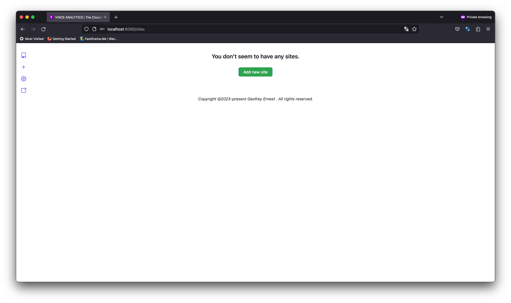
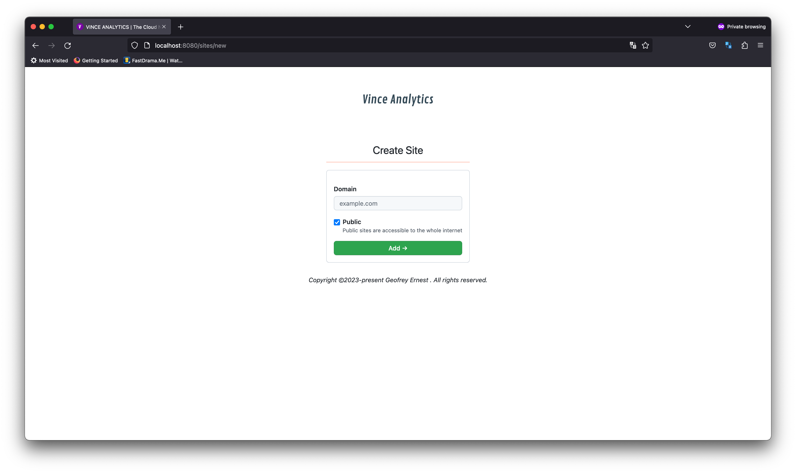

If all went well with the previous guide , after logging in you must be shown this
screen.

Click **Add New Site**

You can fill the form with the domain you want to add.

 - __domain__ : This is the host part of your website. If your website is
 `https://vince.example.com` then domain will be `vince.example.com`
  - __public__: If checked, stats for the website will be visible to everyone on
  the internet, uncheck this if you want only authorized users to view stats.

::: tip You can add a site via Sites API
<<<@/guide/files/create_site.sh
:::

Congratulations, you have just added your first site
